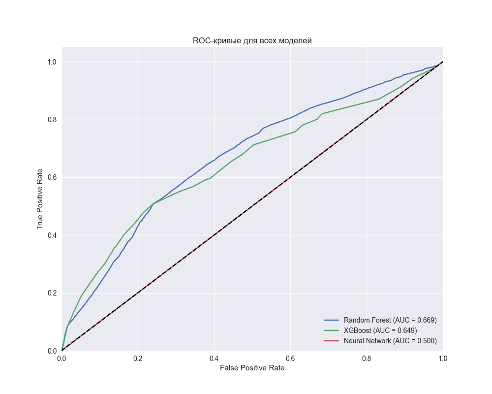
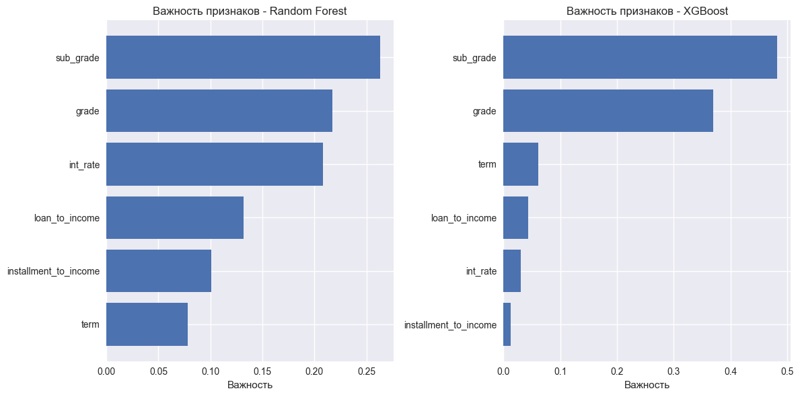
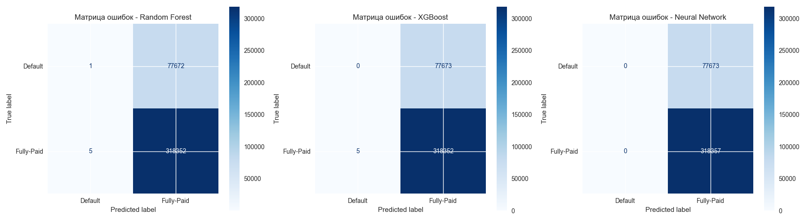

# Анализ кредитных данных

Этот проект представляет собой модульный анализ данных о кредитах и создание модели для прогнозирования их возврата.

## Ключевые результаты

### Сравнение производительности моделей

*ROC-кривые показывают, что все три модели (Random Forest, XGBoost и нейронная сеть) демонстрируют схожую производительность с небольшим преимуществом нейронной сети.*

### Анализ важности признаков

*График важности признаков показывает, что процентная ставка (int_rate) и грейд кредита (grade) являются наиболее значимыми факторами для прогнозирования возврата кредита.*

### Матрицы ошибок

*Матрицы ошибок демонстрируют, как модели классифицируют кредиты. Видно, что модели лучше определяют случаи возврата кредита, чем дефолта.*

## Структура проекта

```
.
├── src/                       # Исходный код
│   ├── data/                 # Модули для работы с данными
│   │   ├── __init__.py
│   │   └── data_loader.py    # Загрузка данных
│   ├── visualization/        # Модули для визуализации
│   │   ├── __init__.py
│   │   ├── visualizer.py     # Создание базовых графиков
│   │   ├── model_visualizer.py # Визуализация моделей
│   │   └── visualize_models.py # Скрипт визуализации результатов
│   ├── preprocessing/        # Модули для предобработки
│   │   ├── __init__.py
│   │   └── preprocessor.py   # Подготовка данных
│   ├── models/              # Модули для работы с моделями
│   │   ├── __init__.py
│   │   └── model_trainer.py  # Обучение и оценка
│   ├── __init__.py
│   └── main.py              # Основной скрипт
├── source/                   # Исходные данные
│   └── lending_club_loan_two.csv
├── models/                   # Сохраненные модели
├── visualizations/          # Графики и визуализации
└── README.md
```

## Описание модулей

### 1. Data Loader (`src/data/data_loader.py`)
- Загрузка данных из CSV
- Базовая обработка
- Определение списков признаков
- Создание целевой переменной

### 2. Visualizer (`src/visualization/visualizer.py`)
- Распределение статусов кредитов
- Распределение числовых переменных
- Анализ категориальных переменных
- Корреляционная матрица

### 3. Model Visualizer (`src/visualization/model_visualizer.py` и `visualize_models.py`)
- ROC-кривые для всех моделей
- Матрицы ошибок
- Важность признаков для Random Forest и XGBoost
- Калибровочные кривые
- Метрики для несбалансированных классов

### 4. Preprocessor (`src/preprocessing/preprocessor.py`)
- Кодирование категориальных признаков
- Масштабирование числовых признаков
- Разделение на обучающую и тестовую выборки
- Сохранение энкодеров и скейлера

### 5. Model Trainer (`src/models/model_trainer.py`)
- Обучение моделей:
  - Random Forest
  - XGBoost
  - Нейронная сеть
- Оценка качества моделей
- Анализ важности признаков
- Сохранение обученных моделей

## Как использовать

1. Убедитесь, что файл с данными находится в директории `source/`

2. Запустите основной скрипт:
   ```
   python src/main.py
   ```

3. Выберите этапы для выполнения:
   - 1: Загрузка данных
   - 2: Создание базовых визуализаций
   - 3: Углубленный анализ признаков
   - 4: Подготовка данных
   - 5: Обучение и оценка моделей
   - 6: Визуализация результатов моделей

## Результаты

### Визуализации данных
В директории `visualizations/`:
- `loan_status_distribution.png`: Распределение статусов кредитов
- `numeric_distributions.png`: Распределение числовых переменных
- `categorical_distributions.png`: Анализ категориальных переменных
- `correlation_matrix.png`: Корреляционная матрица

### Визуализации моделей
- `roc_curves.png`: ROC-кривые всех моделей
- `confusion_matrices.png`: Матрицы ошибок
- `feature_importance.png`: Важность признаков
- `calibration_curves.png`: Калибровочные кривые

### Модели и энкодеры
В директории `models/`:
- Обученные модели:
  - `random_forest_model.pkl`
  - `xgboost_model.pkl`
  - `neural_network_model.h5`
- `scaler.pkl`: Стандартизатор числовых признаков
- Энкодеры для категориальных переменных:
  - `grade_encoder.pkl`
  - `home_ownership_encoder.pkl`
  - `verification_status_encoder.pkl`
  - `purpose_encoder.pkl`
  - `term_encoder.pkl`

## Масштабирование проекта

Проект имеет модульную структуру, что позволяет легко добавлять новую функциональность:

1. Новые источники данных:
   - Добавьте новый класс в `src/data/`
   - Реализуйте интерфейс загрузки данных

2. Новые визуализации:
   - Добавьте новые методы в `LoanVisualizer`
   - Или создайте новый класс визуализации

3. Новые методы предобработки:
   - Расширьте `DataPreprocessor`
   - Добавьте новые методы трансформации

4. Новые модели:
   - Создайте новый класс в `src/models/`
   - Реализуйте интерфейс обучения и оценки

## Требования к установке

```bash
pip install pandas numpy scikit-learn matplotlib seaborn tensorflow xgboost
``` 